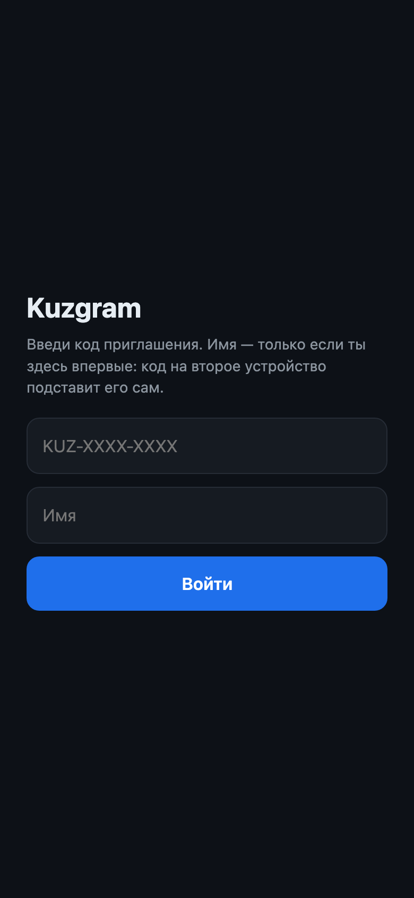
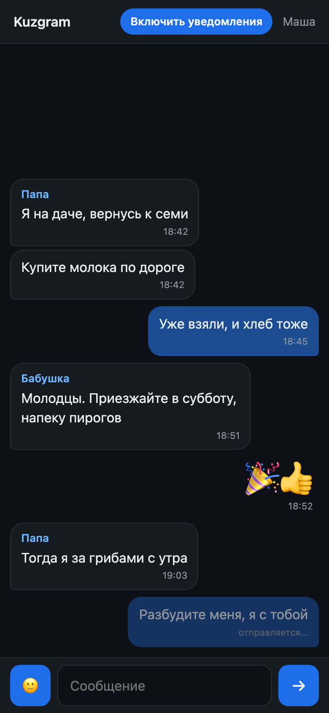
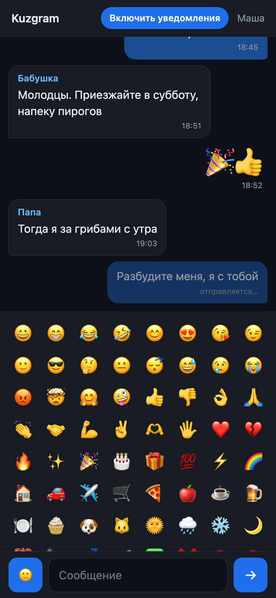

# Kuzgram

Закрытый чат для одной семьи: общая лента на всех, вход по одноразовым кодам,
уведомления на заблокированный iPhone. Разворачивается на домашнем сервере
одной командой и не требует ни аккаунтов, ни облаков, ни чужих серверов.

Node + Express + SQLite на бэкенде, голый HTML/CSS/JS на фронте — без сборщика,
бандлера, фреймворков и TypeScript. Четыре зависимости, ни одной dev-зависимости,
`npm install` ставит 114 пакетов и на этом всё.

Главной задачей было заставить Web Push дойти до iPhone, когда приложение
полностью закрыто, а телефон лежит с заблокированным экраном. Это работает.

|  |  |  |
|:--:|:--:|:--:|
|  |  |  |
| Вход по коду | Общая лента | Смайлики |

**Что умеет**

- Один общий чат на группу до десяти человек, текстовые сообщения
- Пуш-уведомления на iOS 16.4+: имя автора в заголовке, текст в теле,
  тап открывает приложение, а не вкладку Safari
- Вход по одноразовому инвайт-коду, коды выдаёт CLI на сервере
- Отдельный код привязывает второе устройство к тому же человеку
- Устанавливается на домашний экран как обычное приложение
- Оптимистичная отправка: сообщение появляется мгновенно, при обрыве связи
  краснеет и повторяется по тапу
- Смайлики: панель в композере и крупный показ сообщений из одних эмодзи

**Чего нет и не будет**

Файлов, картинок, реакций, тредов, статусов прочтения, редактирования,
удаления, личных переписок, регистрации по почте. Это не клон телеграма,
а ровно то, что нужно семье.

## Как это развёрнуто

Приложение слушает `0.0.0.0:3000` и говорит по обычному HTTP. TLS
терминируется снаружи — на домашнем роутере, nginx или любом другом прокси,
который умеет проксировать на внутренний адрес. Сертификатов и редиректов
на https внутри Node нет намеренно.

Дальше в примерах адрес обозначен как `https://chat.example.com` — подставь
свой. Домен обязательно должен быть на https: без этого не будет ни service
worker, ни уведомлений.

## Запуск

Сначала ключи для пушей — без них сервер не стартует:

```bash
cp .env.example .env
npx web-push generate-vapid-keys   # положить пару в .env
```

### В Docker

```bash
docker compose up -d --build
docker compose logs -f kuzgram
```

База и WAL-файлы лежат на хосте в `./data`, так что пересборка образа
переписку не трогает. Контейнер работает от непривилегированного пользователя,
`restart: unless-stopped` поднимает его после перезагрузки машины, healthcheck
дёргает `/api/vapid-public-key` раз в полминуты.

```bash
docker compose exec kuzgram node bin/invite.js            # выдать код
docker compose exec kuzgram node bin/invite.js --user 2   # код на устройство
docker compose down                                       # остановить
```

### Без Docker

```bash
npm install
npm start
```

Нужен Node 22 или новее: код использует встроенный тест-раннер и `fetch`.
Простейший способ держать процесс живым — `nohup npm start > server.log 2>&1 &`,
но перезагрузку машины это не переживёт; для постоянной работы лучше
systemd-юнит или всё-таки Docker.

Переезд с голого запуска в контейнер: остановить процесс, слить WAL
(`node -e 'require("better-sqlite3")("kuzgram.db").pragma("wal_checkpoint(TRUNCATE)")'`),
скопировать `kuzgram.db` в `./data/` и поднять compose.

## Приглашения

Кодами управляет только CLI, самообслуживания нет.

```bash
npm run invite                  # новый участник: код + имя при входе
npm run invite -- --user Маша   # ещё одно устройство существующему участнику
npm run invite -- --user 2      # то же самое, по id
npm run invite -- --ttl 2       # срок жизни 2 часа вместо 48 по умолчанию
npm run invite -- --ttl 0       # без срока (не рекомендуется)
```

Код одноразовый и живёт 48 часов. **Каждое устройство требует своего кода**:
на iOS у PWA с домашнего экрана и у Safari разные хранилища, токен между ними
не переезжает. Переустановка иконки с «Домой» тоже стирает токен — нужен новый
код на устройство.

Отзыв доступа — удалить строку из `tokens` (или все строки пользователя):

```sql
DELETE FROM tokens WHERE user_id = 3;   -- выкинет со всех устройств
```

Удалять самого пользователя сложнее: на него ссылаются сообщения, токены,
подписки и инвайты, внешние ключи включены. Порядок — подписки, токены,
сообщения, инвайты (`used_by` и `for_user`), затем сам пользователь.

## Как это устроено

| Файл | Роль |
|---|---|
| `server.js` | Роуты, статика, `sw.js` с `no-cache` |
| `db.js` | SQLite: схема, подготовленные запросы, транзакция погашения инвайта |
| `auth.js` | Токены (32 случайных байта), middleware `Authorization: Bearer` |
| `push.js` | Рассылка через web-push, чистка мёртвых подписок |
| `bin/invite.js` | Генерация кодов |
| `public/transport.js` | Доставка сообщений: опрос раз в 2.5 с. Меняется на WebSocket без правок остального фронта |
| `public/app.js` | Экраны входа и чата, лента, отправка, подписка на пуши |
| `public/sw.js` | Показ уведомлений, клик по уведомлению |
| `Dockerfile` | Двухстадийная сборка: тулчейн для нативного модуля остаётся в первом слое |
| `docker-compose.yml` | Том `./data`, `.env`, порт 3000, автоперезапуск |

API: `POST /api/join`, `GET /api/me`, `GET /api/messages?after=<id>`,
`POST /api/messages`, `POST /api/subscribe`, `GET /api/vapid-public-key`.
Всё, кроме `join` и `vapid-public-key`, требует токен.

Переменные окружения: `VAPID_PUBLIC`, `VAPID_PRIVATE`, `VAPID_SUBJECT`,
плюс необязательные `KUZGRAM_DB` (путь к базе, для тестов),
`JOIN_MAX_FAILS` и `JOIN_WINDOW_MS` (порог блокировки перебора кодов).

## Тесты

```bash
npm test          # 52 проверки
npm run coverage  # то же самое с отчётом покрытия
```

Встроенный `node:test`, никаких зависимостей. Каждый файл поднимает свою базу
во временном каталоге и подменяет отправку пушей, так что сеть не задействована.

| Файл | Что покрывает |
|---|---|
| `test/db.test.js` | Схема и миграции, погашение инвайтов, токены, сообщения, подписки |
| `test/api.test.js` | Все роуты: коды ответов, валидация, заголовки, рассылка при отправке |
| `test/push.test.js` | Рассылка: кому уходит, TTL и urgency, удаление на 404/410, живучесть при 500 |
| `test/security.test.js` | Доступ: чтение без токена, кривая авторизация, перебор кодов, гонка за инвайт, утечки статики |

Покрытие бэкенда: `auth.js` 100%, `db.js` 100% строк, `push.js` 96.7%,
`server.js` 96.8%. Незакрыты только ветка «VAPID не настроен» и блок `listen`.
Фронт (`public/*.js`) тестами не покрыт: без DOM-окружения это потребовало бы
зависимостей, которых в проекте решено не держать. Проверяется руками
по чек-листу из раздела про уведомления.

## Уведомления на iPhone

1. Safari → `https://chat.example.com` → Поделиться → «На экран Домой»
2. Открыть **с иконки** (из вкладки Safari push не заработает)
3. Войти по коду устройства → тапнуть «Включить уведомления» → «Разрешить»

Диалог разрешения показывается только по прямому тапу и только один раз:
если нажать «Не разрешать», iOS больше не спросит, и лечится это лишь удалением
иконки с «Домой» и повторной установкой.

## Модель доступа

Чат закрытый: без валидного токена наружу не отдаётся ни одно сообщение и ни
одно имя. Токена нет ни у кого, кроме тех, кто погасил инвайт-код.

**Что защищает вход**

- Регистрация только по коду. Кода нет — нет и способа завести пользователя:
  других путей создания строки в `users` в API не существует
- Код одноразовый: гасится в той же транзакции, где создаётся пользователь,
  так что параллельные запросы одним кодом дают ровно одного участника
- Код живёт 48 часов и потом не принимается
- Перебор: 15 промахов по несуществующим кодам за 10 минут — и `/api/join`
  отвечает 429 до конца окна. Считаются только выстрелы мимо, повторный тап
  «Войти» с уже использованным кодом блокировку не приближает
- Пространство кодов — 31⁸ ≈ 8·10¹¹ комбинаций, алфавит без похожих символов
- Токен — 32 случайных байта из `crypto.randomBytes`, сравнивается поиском
  по первичному ключу, живёт до удаления строки

**Что защищает страницу**

- CSP `default-src 'self'` без `unsafe-inline`: инлайн-скриптов на странице нет,
  так что политику можно держать строгой. Плюс `nosniff`, `X-Frame-Options: DENY`,
  `frame-ancestors 'none'`, `Referrer-Policy: no-referrer`
- CORS-заголовков нет намеренно: чужая страница не прочитает ответы API.
  Токен ездит в заголовке, а не в куке, поэтому CSRF тут неприменим
- Весь пользовательский текст попадает в DOM только через `textContent`
- HSTS на год. Полный запрет http возможен только на прокси, см. ниже
- `.env` и `kuzgram.db` — права `600`

**Известные компромиссы**

- **Блокировка перебора общая, не по IP.** Если прокси не проставляет
  `X-Forwarded-For` (домашние роутеры этим грешат), настоящий адрес клиента
  до Node не доходит и различать источники нечем. Побочный эффект: тот, кто
  устроит перебор, на 10 минут перекроет регистрацию всем. Читать переписку
  это ему не даёт. Когда заголовок есть, счётчик несложно сделать поадресным
- **http:// может отвечать.** Соединение на 80-м порту принимает прокси, Node
  о схеме запроса не знает вовсе. HSTS закрывает вопрос для браузеров; полный
  отказ настраивается только на прокси — не пробрасывать порт 80
- **Сквозного шифрования нет.** Текст сообщения уходит в пуш и виден Apple,
  в базе лежит открытым. Для семейного чата это осознанный выбор
- **Токены в базе в открытом виде.** Хранить их хэш имело бы смысл, если бы
  база не содержала саму переписку; здесь это ничего не добавляет
- Токен живёт в `localStorage`: украсть его может только XSS, против которого
  и стоит CSP

## Если не работает

**Кнопки «Включить уведомления» нет.** Разрешение уже выдано — кнопка прячется.
Проверить: Настройки → Уведомления → Kuzgram.

**Кнопка есть, диалог не появляется.** Открыто из Safari, а не с «Домой».
Либо iOS ниже 16.4 — там Web Push нет вовсе.

**`[push] отправлено 0` в логе.** Подписок в базе нет: `SELECT * FROM subscriptions`.
После переустановки PWA подписку надо оформить заново.

**Контейнер падает при старте с жалобой на VAPID.** `.env` не подхватился:
`env_file` ищет его рядом с `docker-compose.yml`. Проверить —
`docker compose exec kuzgram env | grep VAPID`.

**После пересборки образа пропала переписка.** База должна лежать на томе
`./data`, а не внутри контейнера: проверить, что `KUZGRAM_DB=/data/kuzgram.db`
и каталог примонтирован.

**`[push] 410, подписка удалена`.** Нормальное поведение: подписка протухла,
сервер сам её выкинул. Оформить заново с устройства.

**Пуш ушёл, на телефоне тихо.** «Фокусирование», режим экономии энергии либо
выключенные баннеры для Kuzgram. Apple при экономии энергии задерживает доставку.

**Правки в `sw.js` не подхватываются.** Отдаётся с `Cache-Control: no-cache`,
в `activate` сносятся все кеши, но старый воркер может ещё висеть активным:
полностью закрыть PWA и открыть заново.

**Вход просит код, хотя вчера пускал.** Токен жил в хранилище, которое стёрлось
(переустановка иконки, очистка данных Safari). Выдать код на устройство.

**«Срок действия кода истёк».** Коду больше 48 часов. Выдать новый.

**«Слишком много попыток».** Сработала защита от перебора: 15 промахов по
несуществующим кодам за 10 минут. Отпустит само через 10 минут после последней
попытки, перезапуск сервера тоже сбрасывает счётчик.

## Лицензия

MIT, см. [LICENSE](LICENSE).

**Снаружи не открывается.** Проверить, что слушает `0.0.0.0:3000`, а не
`127.0.0.1`: `ss -ltnp | grep 3000`. Настройки роутера не трогать.
